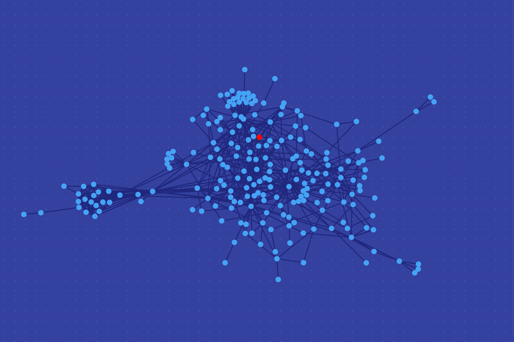

# DN42 Wallpaper



*It looks like a pig! Totally unintended I swear.*

The red dot represents my AS on DN42, AS4242421926. Peer with me [here](https://zfg.li/dn42)!

## Why?

- I'm bored.
- I need a new wallpaper.
- I want to make my desktop geekier with some Data Visualization (tm).
- I have a full BGP feed of DN42.

And then, I discovered the amazing BGP tool known as [ExaBGP](https://github.com/Exa-Networks/exabgp), and everything came together.

## How?

Assuming you have a machine running [ExaBGP](https://github.com/Exa-Networks/exabgp) and Redis, use the following configuration to fill the Redis database with all routes coming from neighbors:
```
process dn42wp {
        run /where/is/exabgp-process.py;
        encoder json;
}

neighbor x.x.x.x {
        # Your peer configuration here

        api {
                processes [ dn42wp ];
                receive {
                        parsed;
                        update;
                }
        }
}
```

Then, run `generate-json.py` to generate a JSON containing all peerings.
Save it as `data.json` and serve it in the same directory of the page.

## But there is already [https://nixnodes.net/dn42/graph](https://nixnodes.net/dn42/graph/)!

It's not particularly suitable as a wallpaper, and I don't get to play with the cool toys myself.

By the way, have you heard of [the IKEA effect](https://en.wikipedia.org/wiki/IKEA_effect)?

## Disclaimer

Hacked together in a couple of hours, with all sorts of terrible code and quirks.
My scripts do not inject any route, but if you believe in Illuminati, filter all routes on your router.

## Acknowledgments

- [ExaBGP](https://github.com/Exa-Networks/exabgp), for hours of fun playing with routing information programmatically.
- [Edmundo Santos](https://codepen.io/edmundojr/pen/xOYJGw), for his awesome CSS background that I kanged here shamelessly.
